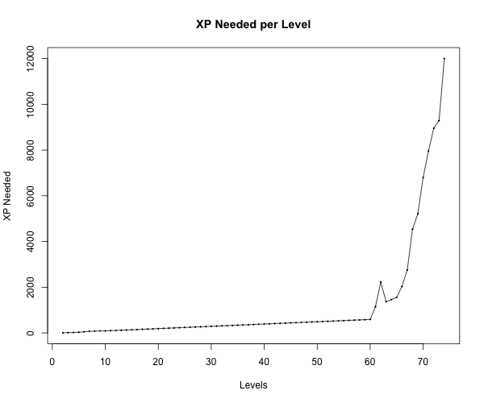
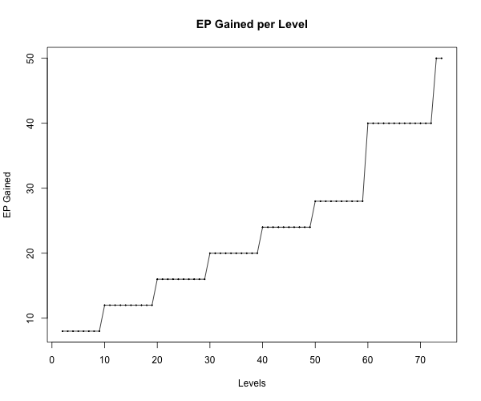

# ARK: Survival Evolved Data

A collection of data associated with the [ARK: Survival Evolved][ark] game.

## XP Needed per Level

The amount of XP needed from levels 2–74 are graphed below.

The data was retrieved on August 4, 2015 from the [Levels wiki
page][wiki-levels]. The raw data can be found in [levels.tsv](levels.tsv). The
figures were generated by the R code found in [levels.R](levels.R).

## EP Gained per Level

The amount of EP gained from levels 2-74 are graphed below.

The data was retrieved on August 4, 2015 from the [Levels wiki
page][wiki-levels]. The raw data can be found in [levels.tsv](levels.tsv). The
figures were generated by the R code found in [levels.R](levels.R).

## Sources

* [ARK Survival Evolved Wiki][wiki]

[ark]:http://playark.com/
[wiki]:http://ark.gamepedia.com/
[wiki-levels]:http://ark.gamepedia.com/Levels
